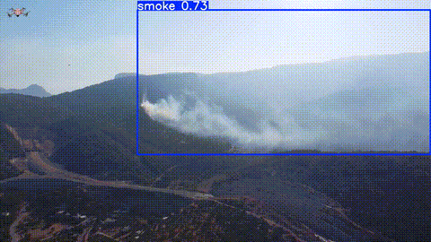
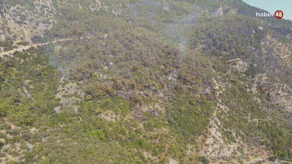
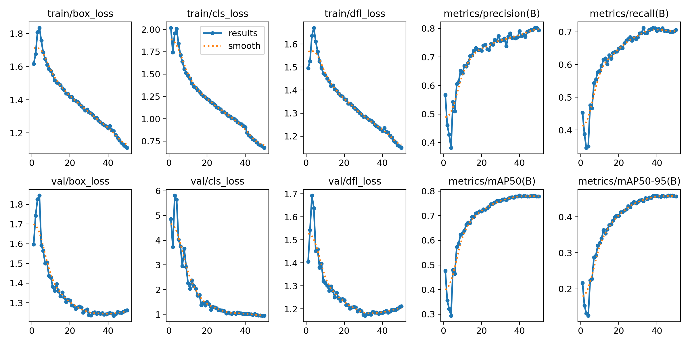
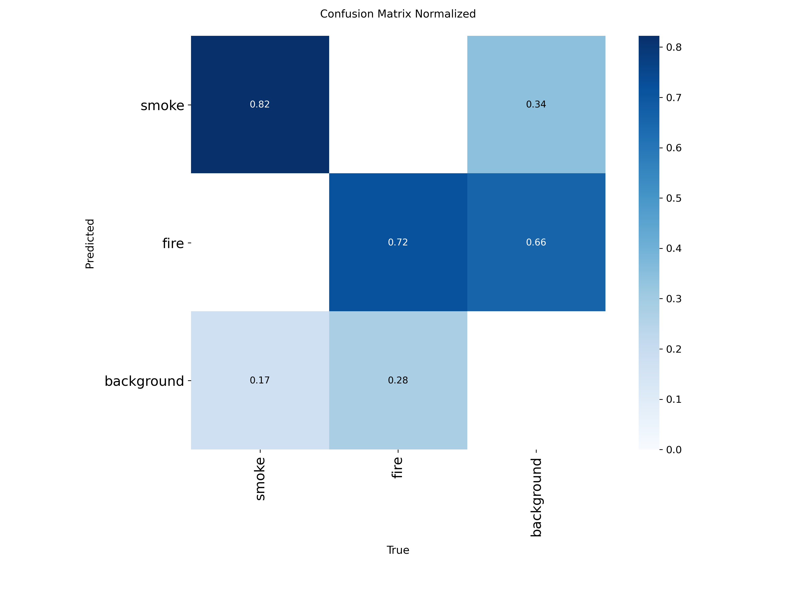
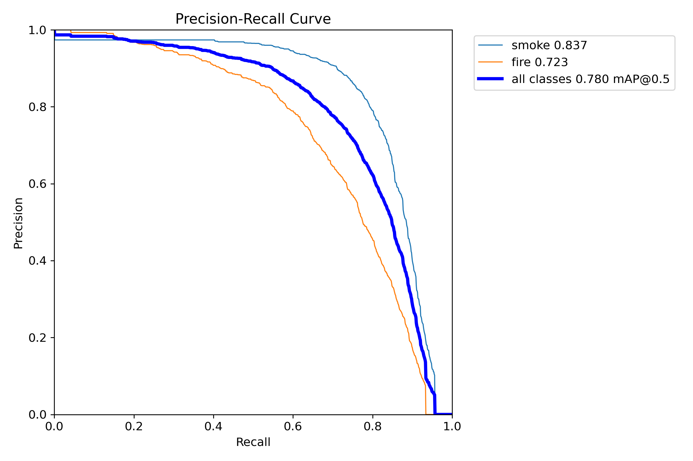
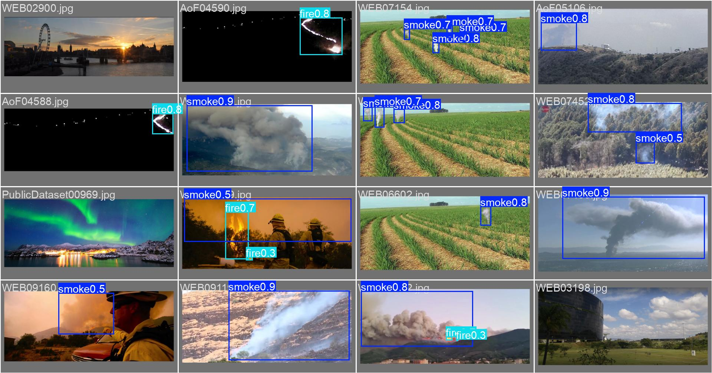

# 🔥 Real-Time Fire & Smoke Detection with YOLO11

An end-to-end computer vision and deep learning project aimed at early detection of wildfires, structural fires, and rising smoke plumes using the latest **YOLO11s** architecture. 

The model was fine-tuned on a multi-class dataset and stress-tested against unseen real-world YouTube video streams using memory-optimized inference pipelines.

---

## 📌 Key Highlights
* **Backbone:** YOLO11 Small (`yolo11s.pt` - 9.4M parameters)
* **High Efficiency:** 2.7 ms inference speed per frame on GPU
* **Class Separation:** Outstanding performance on diffused smoke plumes (**83.7% mAP50**)
* **Lightweight Model:** `best.pt` is only **19.2 MB**, fully ready for edge devices & embedded systems

---

## 🎬 Real-World Video Inferences (YouTube Demos)

The model was evaluated on real-world video streams with `conf=0.5`, `imgsz=320`, and FP16 (`half=True`) acceleration:

| Demo 1: Wildfire & Smoke Dispersion | Demo 2: Industrial Fire & Smoke |
| :---: | :---: |
|  |  |
| *Source: [YouTube Vu_Q0sflTeY](https://www.youtube.com/watch?v=Vu_Q0sflTeY)* | *Source: [YouTube awdbnnbSpQw](https://www.youtube.com/watch?v=awdbnnbSpQw)* |

---

## 📊 Benchmark & Evaluation Results

Evaluated on unseen validation split (3,094 images, 3,917 instances):

| Class | Precision (P) | Recall (R) | mAP@50 | mAP@50-95 |
| :--- | :---: | :---: | :---: | :---: |
| **All Classes** | **0.796** | **0.700** | **0.780** | **0.459** |
| 🌫️ **Smoke** | 0.837 | 0.773 | **0.837** | 0.524 |
| 🔥 **Fire** | 0.754 | 0.627 | **0.723** | 0.394 |

* **Speed Metrics (per image):**
  * Preprocess: `0.2 ms`
  * Inference: `2.7 ms`
  * Postprocess: `1.6 ms`

---

## 📈 Training Visualizations & Metric Curves

The model was trained for 50 epochs on an NVIDIA Tesla T4 GPU (~5.34 hours).

### 1. Loss & Metric Trends


### 2. Confusion Matrix & PR Curve
| Normalized Confusion Matrix | Precision-Recall (PR) Curve |
| :---: | :---: |
|  |  |

### 3. Sample Validation Ground Truth vs Predictions


---

## 📁 Dataset Details
* **Source:** [Smoke and Fire Detection Dataset (YOLO)](https://www.kaggle.com/datasets/sayedgamal99/smoke-fire-detection-yolo) on Kaggle
* **Total Samples:** ~17,200+ annotated images
* **Splits:** Train (14,101 images), Validation (3,094 images)
* **Classes:** `0: Smoke`, `1: Fire`

---

## 📂 Repository Structure
```text
fire-and-smoke-detection-yolo/
├── assets/
│   ├── demo1.gif                  # Sample YouTube test animation 1
│   ├── demo2.gif                  # Sample YouTube test animation 2
│   └── metrics/                   # Training loss curves, confusion matrices
├── notebooks/
│   ├── image_processing.ipynb     # Image analysis & pipeline experimentation
│   └── yolo_training.ipynb        # Dataset setup, training loop & streaming inference
├── weights/
│   └── best.pt                    # Fine-tuned YOLO11s model weights (19.2 MB)
├── requirements.txt               # Dependencies
└── README.md
```

---

## 🚀 Quick Start & Usage

### 1. Installation
```bash
git clone [https://github.com/Aleyna-Sahan/fire-and-smoke-detection-yolo.git](https://github.com/Aleyna-Sahan/fire-and-smoke-detection-yolo.git)
cd fire-and-smoke-detection-yolo
pip install -r requirements.txt
```

### 2. Real-Time Inference on Video Stream
```python
from ultralytics import YOLO

# Load the fine-tuned model
model = YOLO("weights/best.pt")

# Predict on YouTube video or local video with RAM-safe streaming
results = model.predict(
    source="[https://www.youtube.com/watch?v=awdbnnbSpQw](https://www.youtube.com/watch?v=awdbnnbSpQw)",
    conf=0.5,
    imgsz=320,
    half=True,
    stream=True,
    save=True
)

for r in results:
    pass
```

---

## 👤 Author
* **Aleyna Şahan**
  * GitHub: [@Aleyna-Sahan](https://github.com/Aleyna-Sahan)
